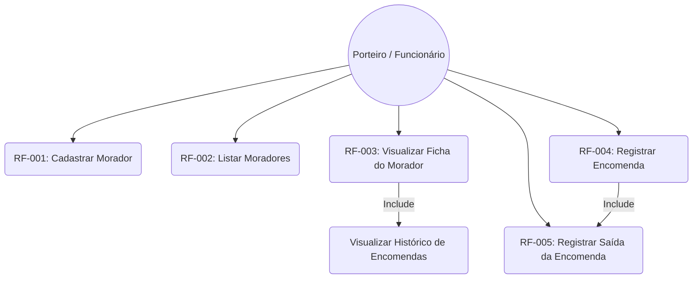
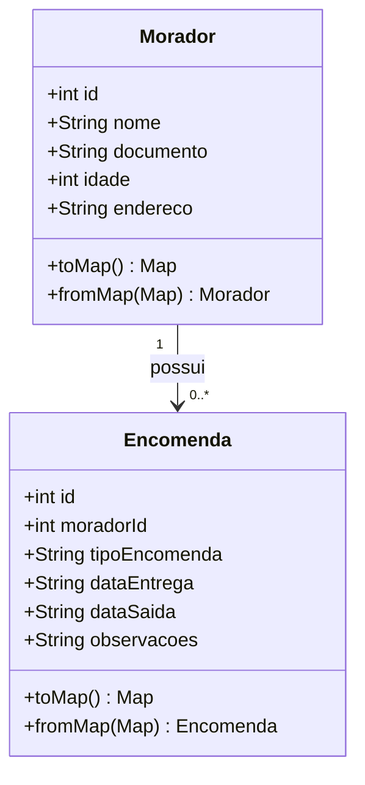
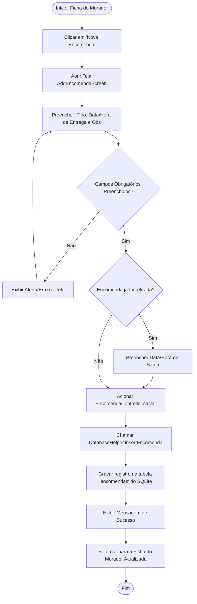
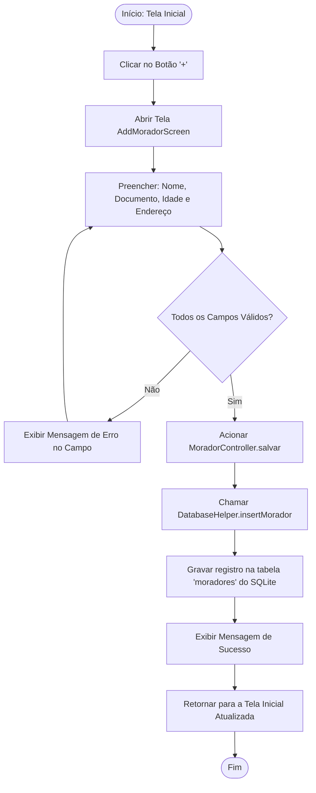

# Documentação de Requisitos de Software (DRS) – App Registro de Encomendas

**Padrão de Referência:** ISO/IEC/IEEE 29148:2018

**Versão:** 1.0

---

## 1. Introdução

### 1.1 Finalidade

Este documento especifica os requisitos e a arquitetura de um Registro de Entregas de Encomendas. O sistema utiliza o framework Flutter para a interface de usuário e lógica de controle, e o banco de dados SQLite para persistência local de dados.

### 1.2 Escopo do Sistema

Esse sistema tem como intuito ajudar porteiros ou funcionários responsáveis por receber encomendas em condomínios ou prédios residenciais. Ele permite o cadastro local de moradores e o registro de encomendas recebidas e retiradas.

* **O que está no escopo:** Cadastro de offline moradores, registro de encomendas com data de entrega e saída, persistência em banco relacional local (SQLite), validação de formulários e visualização do histórico de encomendas por morador.
* **O que está fora de escopo:** Autenticação de usuários (login), sincronização em nuvem (Cloud API), notificações *push* em tempo real e relatórios exportáveis.

---

## 2. Descrição Geral

### 2.1 Perspectiva do Produto

O produto opera de forma autônoma (*standalone*) em dispositivos móveis (Android/iOS), sem dependência de servidores externos para o seu funcionamento principal. A arquitetura segue o padrão de responsabilidade segregada em camadas (UI, Controllers, Models, Data Access).

### 2.2 Funções do Produto

* Manter registro de Moradores (CRUD).
* Registrar Encomendas vinculadas a um Morador específico.
* Registrar a saída (retirada) de uma encomenda.
* Listar Moradores cadastrados e visualizar histórico de encomendas por morador.

### 2.3 Classes e Características dos Usuários

* **Porteiro / Funcionário do Condomínio:** Usuário com nível básico de instrução digital que necessita de agilidade no registro de encomendas no momento do recebimento ou da entrega ao morador.

---

## 3. Requisitos do Sistema

### 3.1 Requisitos Funcionais (RF)

| Identificador | Requisito | Descrição | Prioridade |
| --- | --- | --- | --- |
| **RF-001** | Cadastrar Morador | O sistema deve permitir a inserção de um novo morador contendo: nome completo, documento (CPF/RG), idade e endereço (apto/bloco). | Essencial |
| **RF-002** | Listar Moradores | A tela inicial do sistema deve exibir uma listagem de todos os moradores armazenados em ordem alfabética. | Essencial |
| **RF-003** | Visualizar Ficha do Morador | O sistema deve exibir a ficha detalhada do Morador selecionado, incluindo todos os seus dados cadastrais e a lista cronológica de suas encomendas. | Essencial |
| **RF-004** | Registrar Encomenda | O sistema deve permitir o registro de uma encomenda vinculada a um morador, informando: tipo de encomenda, data/hora de entrega e observações. | Essencial |
| **RF-005** | Registrar Saída da Encomenda | O sistema deve permitir informar a data/hora em que o morador retirou a encomenda, por meio de um campo opcional na tela de registro. | Essencial |
| **RF-006** | Persistência Local | O sistema deve salvar todas as informações de forma permanente no banco de dados SQLite interno do aparelho. | Essencial |

### 3.2 Requisitos Não-Funcionais (RNF)

| Identificador | Requisito | Descrição | Categoria |
| --- | --- | --- | --- |
| **RNF-001** | Portabilidade | O aplicativo deve rodar em sistemas operacionais Android (versão 8.0 ou superior) e iOS (versão 13 ou superior). | Portabilidade |
| **RNF-002** | Desempenho | O tempo de carregamento da lista de moradores e encomendas locais não deve exceder 2 segundos. | Eficiência |
| **RNF-003** | Disponibilidade | O aplicativo deve funcionar 100% do tempo em modo offline, sem exigir conexão com a internet. | Confiabilidade |
| **RNF-004** | Arquitetura | O código-fonte deve respeitar a separação em camadas (`lib/model`, `lib/controller`, `lib/service`, `lib/views`). | Manutenibilidade |

---

## 4. Diagramas de Engenharia de Software

### 4.1 Diagrama de Casos de Uso

Demonstra o comportamento do sistema a partir do ponto de vista do usuário (Porteiro/Funcionário).

### 4.2 Diagrama de Classes

Demonstra as entidades do sistema, seus atributos, métodos e relacionamentos.

Relacionamento entre Morador e Encomendas de **1 para muitas (1:N)**

### 4.3 Diagrama de Fluxo (Registro de Encomenda)

Ilustra o fluxo que o usuário percorre, passando pela validação lógica, até a persistência dos dados.

### 4.4 Diagrama de Fluxo (Cadastro de Morador)

Ilustra o fluxo de cadastro de um novo morador no sistema.

